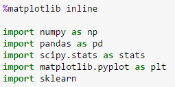
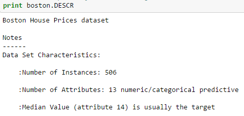
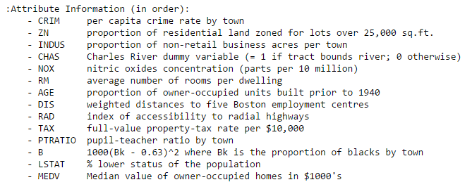

# Linear Regressions

* Scikit-learn is a powerful Python module for machine learning. It contains function for regression, classification, clustering, model selection and dimensionality reduction. 

## Exploring Boston Housing Data Set

* Important functions to keep in mind while fitting a linear regression model are:
* lm.fit() : fits a linear model
* lm.predict() : Predict Y using the linear model with estimated coefficients
* lm.score() : Returns the coefficient of determination (R^2). A measure of how well-observed outcomes are replicated by the model, as the proportion of total variation of outcomes explained by the model.

## Linear Regression in Python

* Regression searches for relationships among variables.

* find a function that maps some features or variables to others sufficiently well.

* the dependent features are called the dependent variables, outputs, or responses. The independent features are called the independent variables, inputs, regressors, or predictors.

### Steps for Implementing Linear Regression

* Import libraries, data and clean it.

* Explore data and rename columns as desired.

* Explore data set using .DESCR.

* Use Scikit learn to fit linear regression to the entire data set and calculated the mean squared error.

* Make a train-test split and calculated the mean squared error for my training data and test data.

* Plot the residuals for my training and test datasets.