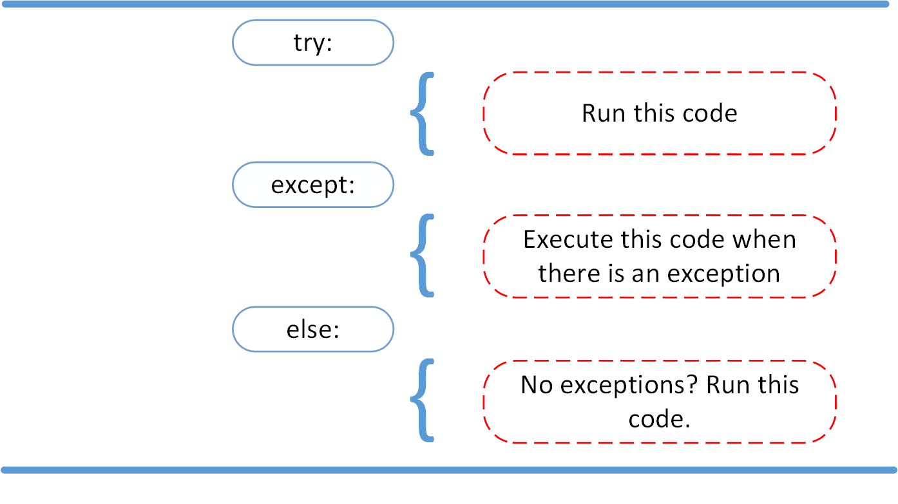
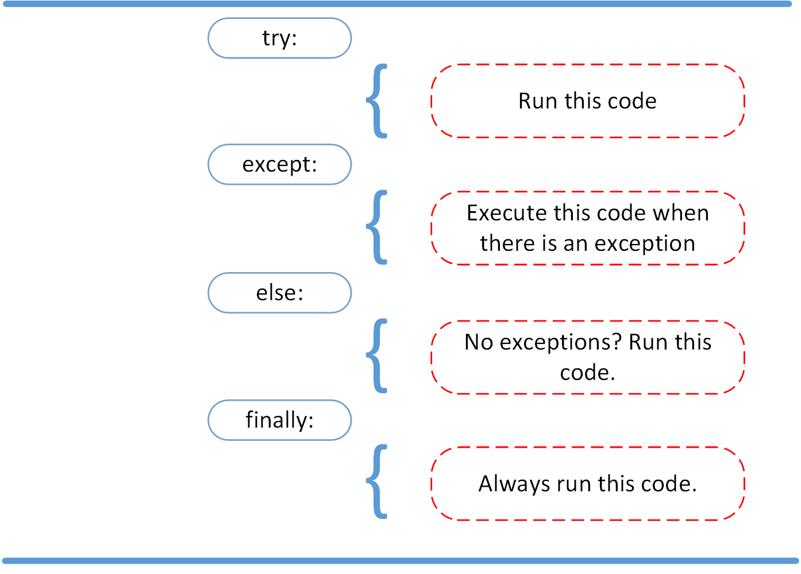

## Reading and Writing Files in Python

## Files on most modern file systems are composed of three main parts:

 * Header: metadata about the contents of the file (file name, size, type, and so on)
* Data: contents of the file as written by the creator or editor
* End of file (EOF): special character that indicates the end of the file

## File Paths

* Folder Path: the file folder location on the file system where subsequent folders are separated by a forward slash / (Unix) or backslash \ (Windows)
* fle Name: the actual name of the file
* Extension: the end of the file path pre-pended with a period (.) used to indicate the file type

## Opening and Closing a File in Python

### Python has a built-in method called open() that allows you to open file, there are two ways to open file in Python:

file = open('dog_breeds.txt')

## Opening a file in this way you must close the file manually after executing you code using;

file.close()

## Text File Types

A text file is the most common file that you’ll encounter. Here are some examples of how these files are opened:

open('abc.txt')

open('abc.txt', 'r')

open('abc.txt', 'w')

### Buffered Binary File Types

A buffered binary file type is used for reading and writing binary files. Here are some examples of how these files are opened:

open('abc.txt', 'rb')

open('abc.txt', 'wb')

## Raw binary files

 open('abc.txt', 'rb', buffering=0)

 ## Readline and print.

 ## Reading and Writing Opened Files

 
| Method      | What It Do|
| :-----------: | :----------- |
| .read(size=-1)   | This reads from the file based on the number of size bytes |
|.readline(size=-1)    | This reads at most size number of characters from the line |
| .readlines()   |This reads the remaining lines from the file object and returns them as a list.  |

## Python Exceptions: An Introduction

* A Python program terminates as soon as it encounters an error. In Python, an error can be a syntax error or an exception. In this article, you will see what an exception is and how it differs from a syntax error. After that, you will learn about raising exceptions and making assertions. Then, you’ll finish with a demonstration of the try and except block.

* Exceptions vs Syntax Errors

Important Note: You can't handle syntax error..., exception errors are when a code is syntactically correct but result in an error.

## The AssertionError Exception

## The try and except Block: Handling Exceptions

* try : all statements are executed until an exception is encountered.

* except :is used to catch and handle the exception(s) that are encountered in the try clause.

## The else Clause

*  lets you code sections that should run only when no exceptions are encountered in the try clause.

## Cleaning Up After Using finally

* nables you to execute sections of code that should always run, with or without any previously encountered exceptions.

